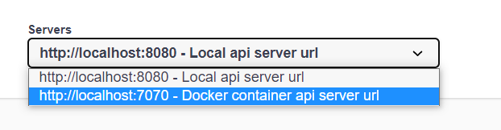

# About project

## Simple Spring Boot project based on PostgreSQL and Docker Compose

To run the project, download it to your computer or clone it from:
<https://github.com/richart-proger/spring-boot-postgres-docker-compose-demo-2>

*If you are NOT using a Linux machine, you need a virtualized server. If you install VirtualBox, other tools like the Mac’s boot2docker can seamlessly manage it for you. Visit <a href="https://www.virtualbox.org/wiki/Downloads">VirtualBox’s download site</a> and pick the version for your machine. Download and install. Do not worry about actually running it.*

*You also need Docker, which only runs on 64-bit machines. See https://docs.docker.com/installation/#installation for details on setting Docker up for your machine. Before proceeding further, verify you can run docker commands from the shell. If you use boot2docker, you need to run that first.*

### How to configure

1. Package the application as a JAR file:
```bash
./mvnw clean package -DskipTests
```

2. Copy the application JAR file to *src/main/docker* directory. To do this, run the following command:
```bash
cp target/spring-boot-postgres-docker-demo-2-0.0.1-SNAPSHOT.jar src/main/docker
```
3. Execute next command to go to our *docker-compose* file:
```bash
cd src/main/docker
``` 
4. Build the Docker Image for our Spring Boot application:
```bash
docker-compose up
```
5. The app will start running at <http://localhost:7070/api/students/list>.
6. OpenAPI Specification will be available at <http://localhost:7070/swagger-ui/index.html#>
7. Choose a suitable url:


8. To stop the application, use Ctrl + C in the terminal.
9. Stop containers:
```bash
docker-compose down
```
10. Remove containers:
```bash
docker rmi spring-boot-demo-2:latest
```

*The normal operation of the application (without Docker Compose) is carried out on the resource <http://localhost:8080/api/students/list>*

*Its OpenAPI Specification will be available at <http://localhost:8080/swagger-ui/index.html#>*